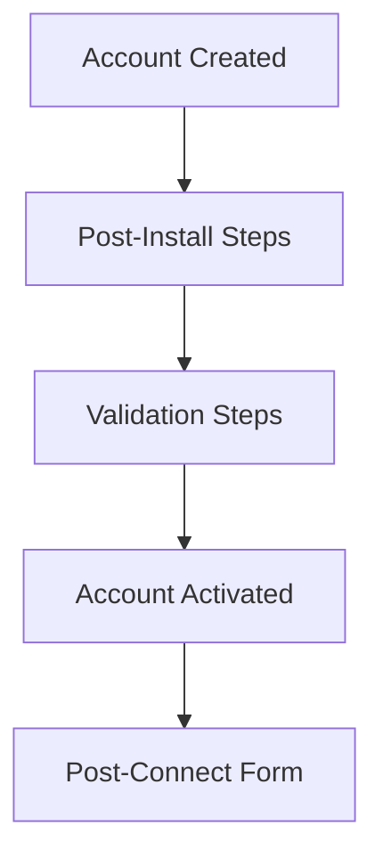

## Flow Overview

## Step Details

### 1. Account Created

When a user completes authentication, Handled creates an Integrated Account.

**Webhook event:** `integrated_account:created`

### 2. Post-Install Steps

Automated operations that run after account creation:
- Fetching initial configuration
- Setting up required tokens
- Storing account metadata

**On failure:** `integrated_account:post_install_error` webhook sent

### 3. Validation Steps

API calls that verify the connection works:
- Test that credentials are valid
- Check required permissions exist
- Verify API access

**On failure:** `integrated_account:validation_error` webhook sent

### 4. Account Activated

The account is ready for use. You can now:
- Make Unified API calls
- Make Proxy API calls
- Set up sync jobs

**Webhook event:** `integrated_account:active`

### 5. Post-Connect Form

If RapidForm is configured, the user fills out additional fields:
- Select specific workspaces
- Choose data to sync
- Configure preferences

**Webhook event:** `integrated_account:post_connect_form_submitted`

## Handling Failures

If post-install or validation steps fail:
- The account is **not** automatically deleted
- The user sees an error message
- Link SDK throws an error
- You receive a webhook notification

<Note>
Delete failed accounts manually or prompt the user to retry.
</Note>
