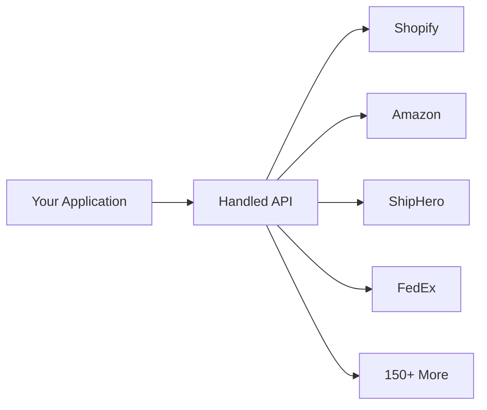

## What is Handled?

Handled is an integration infrastructure platform for commerce. Instead of building separate integrations for Shopify, Amazon, FedEx, ShipHero, and every other service, you connect to Handled once. We handle the complexity.

## Core Features

<CardGroup cols={2}>
  <Card title="Unified APIs" icon="layer-group" href="/unified-apis/overview">
    Standardized endpoints that work the same across all integrations. A `GET /unified/wms/orders` call returns consistent data whether the source is ShipHero, Deposco, or Logiwa.
  </Card>
  <Card title="Real-Time Data" icon="bolt" href="/how-handled-works/overview">
    Handled connects directly to each service. Your data is always current - no stale caches or sync delays.
  </Card>
  <Card title="150+ Connectors" icon="plug" href="/integrations/overview">
    Pre-built integrations across WMS, ecommerce, carriers, billing, and more. Each connector handles authentication, pagination, and rate limits automatically.
  </Card>
  <Card title="Embedded Connector" icon="window" href="/link-sdk/overview">
    A drop-in UI component that lets your customers connect their own accounts directly from your application.
  </Card>
</CardGroup>

## How It Works

1. **Connect** - Install an integration from our catalog
2. **Authenticate** - Your customers connect their accounts via the embedded connector
3. **Access Data** - Use Unified or Proxy APIs to read and write data
4. **Sync** - Set up automated sync jobs to keep data flowing

## Quick Links

<CardGroup cols={3}>
  <Card title="Quickstart" icon="rocket" href="/quickstart">
    Get up and running in 5 minutes
  </Card>
  <Card title="API Reference" icon="code" href="/api-reference/introduction">
    Complete API documentation
  </Card>
  <Card title="Integrations" icon="grid" href="/integrations/overview">
    Browse available connectors
  </Card>
</CardGroup>
