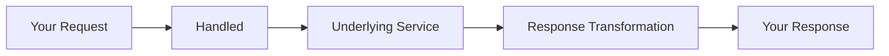

## Overview

When you call `GET /unified/wms/orders`, here's what happens:



## Step-by-Step Flow

### 1. Receive Request

```
GET /unified/wms/orders?status=pending
```

### 2. Check for Static Mapping

Some endpoints return pre-defined data without calling the underlying service.

### 3. Run Before Steps

Pre-processing steps that may:
- Fetch additional data needed for the request
- Validate parameters
- Transform query values

### 4. Map Query Parameters

Transform your query to match the underlying API:

| Your Query | ShipHero Query |
|------------|----------------|
| `status=pending` | `order_status=PENDING` |

### 5. Map Request Body

For create/update operations, transform the request body:

```json
// Your unified request
{"name": "Product A", "sku": "SKU-001"}

// Transformed for Shopify
{"title": "Product A", "variants": [{"sku": "SKU-001"}]}
```

### 6. Make API Call

Send the transformed request to the underlying service.

### 7. Handle Errors

If the underlying API returns an error:
- Transform to standard error format
- Return appropriate HTTP status

### 8. Map Response

Transform the response to unified format:

```json
// ShipHero response
{"order_id": "123", "order_status": "PENDING"}

// Unified response
{"id": "123", "status": "pending"}
```

### 9. Run After Steps

Post-processing steps that may:
- Enrich data with additional calls
- Transform response fields
- Log analytics

### 10. Return Response

Send the unified response back to you.

## Skip API Call (Testing)

For testing, add `?skip_api_call=true` to get mock data without hitting the underlying service:

```bash
curl 'https://api.usehandled.io/api/v1/ipaas/unified/wms/orders?integrated_account_id=ACCOUNT_ID&skip_api_call=true' \
  -H 'Authorization: Bearer YOUR_API_TOKEN'
```
